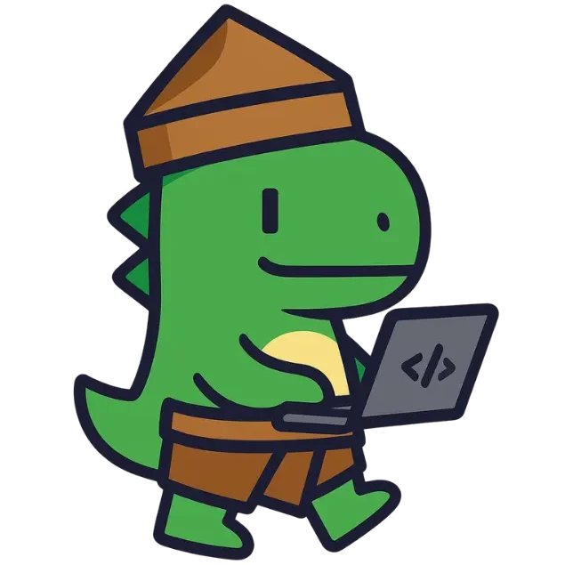

# 🦖 Kodino - Asah Ngoding Lo Bareng Kodino!

<div align="center">
  
  
  [](https://github.com/PD-06/Kodino)
  [](https://kodino.id)
  [](https://kodino.id)
  [](https://kodino.id)
</div>

---

## 🌟 Apa itu Kodino?

**Kodino** adalah platform edukasi pemrograman Python yang **GRATIS** dan dirancang khusus untuk anak-anak Indonesia SD kelas 4-6! 🎓✨

Bersama **Kodi si T-Rex** yang lucu dan **Python si Ular** yang pintar, anak-anak akan belajar ngoding dengan cara yang menyenangkan, menggunakan cerita-cerita menarik yang dekat dengan budaya Indonesia! 🇮🇩

### 🎯 Mengapa Kodino Beda?

- 🦖 **Karakter Menggemaskan**: Belajar bareng Kodi dan Python yang siap jadi teman belajar!
- 🏝️ **Petualangan Indonesia**: Jelajahi pulau-pulau Indonesia sambil belajar programming
- 🎮 **Gamifikasi Seru**: Kumpulkan Dicoin, raih lencana, dan unlock kostum keren!
- 📱 **Mobile-First**: Bisa belajar kapan saja, dimana saja dari HP atau tablet
- 🇮🇩 **100% Bahasa Indonesia**: Semua materi dalam bahasa yang mudah dipahami
- 🆓 **Gratis Selamanya**: Tidak ada biaya tersembunyi, edukasi berkualitas untuk semua!

---

## 🚀 Fitur Utama

### 📚 Kurikulum Lengkap
Kodino menggunakan konsep **petualangan pulau-pulau Indonesia**:

1. **🏔️ Sumatera**: Pendahuluan (Apa itu coding?)
2. **🌳 Kalimantan**: Logika dan Variabel
3. **🦋 Sulawesi**: Struktur Data dan Interaksi
4. **🏝️ Papua**: Struktur Program & Pengulangan Kompleks
5. **☕ Jawa**: Pengembangan Program dan Kode Modular  
6. **🐉 Pulau Komodo**: Pemrograman Bebas

### 🎮 Sistem Gamifikasi
- **💰 Dicoin**: Mata uang virtual untuk membeli item keren
- **🏆 Lencana**: Achievement system untuk setiap pencapaian
- **👕 Kostum**: Dress up Kodi dengan berbagai kostum unik
- **🎨 Artefak**: Kumpulkan item-item spesial dari setiap pulau

### 🤖 AI Assistant
- **Bantuan Pintar**: AI yang siap membantu ketika stuck
- **Quiz Interaktif**: Tes pemahaman dengan AI yang adaptif
- **Feedback Real-time**: Koreksi dan saran instant

---

## 🛠️ Tech Stack

### Frontend
```javascript
// React + TypeScript untuk UI yang responsif
- React 19.1.0 dengan TypeScript
- Vite untuk development yang super cepat
- React Router untuk navigasi smooth
- CSS modern dengan design system kustomisasi
```

### Backend
```python
# Flask + Python untuk backend yang powerful
- Flask dengan SQLAlchemy ORM
- Google Gemini AI untuk fitur AI Assistant
- Database SQLite untuk development
- RESTful API architecture
```

### Design System
- **🎨 Warna Utama**: `#C97336` (Brown yang hangat)
- **📝 Font**: Alibaba Sans untuk heading, Gabriel Sans untuk body
- **🎯 Mobile-First**: Responsive design untuk semua device
- **♿ Accessibility**: Interface yang mudah digunakan untuk anak-anak

---

## 🚀 Quick Start

### Prasyarat
Pastikan sudah terinstall:
- **Node.js** (v18.18.2 atau lebih baru)
- **Python** (3.8+)
- **Git**

### 1. Clone Repository
```bash
git clone https://github.com/PD-06/Kodino.git
cd Kodino
```

### 2. Setup Frontend
```bash
cd Kodino/Frontend
npm install
npm run dev
```
🎉 Frontend akan berjalan di `http://localhost:5173`

### 3. Setup Backend
```bash
cd ../Backend
pip install -r requirements.txt
flask run
```
🚀 Backend akan berjalan di `http://localhost:5000`

---

## 📁 Struktur Project

```
Kodino/
├── 📄 README.md                 # You are here! 👋
├── 📋 design.md                 # Design system & UI guidelines
├── 📝 plan.md                   # Project roadmap & planning
├── 📊 product-spec.md           # Detailed product specifications
├── ✅ tasks.md                  # Development tasks & progress
│
├── 🎨 Frontend/                 # React + TypeScript
│   ├── 📦 package.json
│   ├── ⚙️ vite.config.ts
│   ├── 🌐 public/
│   │   └── 🖼️ images/          # Assets & mascot images
│   └── 💻 src/
│       ├── 📱 components/       # Reusable UI components
│       ├── 📄 page/             # All application pages
│       │   └── 📚 materi/       # Learning modules
│       └── 🔧 services/         # API integration
│
└── 🖥️ Backend/                  # Flask + Python
    ├── 🐍 app.py                # Main Flask application
    ├── 📋 models.py             # Database models
    ├── ⚙️ config.py             # Configuration settings
    ├── 🎨 artefak.py            # Artifact management
    ├── 📦 requirements.txt      # Python dependencies
    ├── 🗄️ instance/             # Database files
    └── 📈 migrations/           # Database migrations
```

---

## 🎮 Gameplay & Learning Flow

### 🎯 Learning Journey
1. **🎪 Onboarding**: Kenalan dengan Kodi dan Python
2. **🗺️ Pilih Pulau**: Mulai petualangan dari Sumatera
3. **📖 Belajar**: Ikuti cerita interaktif step-by-step
4. **💻 Practice**: Coding langsung di browser
5. **🎯 Quiz**: Test pemahaman dengan AI
6. **🏆 Reward**: Dapatkan Dicoin dan unlock item baru!

### 🎨 Personalisasi
- **Dress Up Kodi**: Kostum dari berbagai daerah Indonesia
- **Koleksi Artefak**: Item unik dari setiap pulau
- **Progress Tracking**: Lihat kemajuan belajar secara visual
- **Achievement System**: Badge untuk setiap milestone

---

## 🤝 Contributing

Mau ikut berkontribusi membuat pendidikan coding lebih accessible untuk anak Indonesia? Yuk join! 🚀

### 🐛 Bug Reports
Ada bug? Lapor di [Issues](https://github.com/PD-06/Kodino/issues) dengan detail:
- 📱 Device/browser yang digunakan
- 🔄 Steps to reproduce
- 📸 Screenshot kalau perlu

### 💡 Feature Requests
Punya ide fitur keren? Kami sangat welcome! Buat issue baru dengan label `enhancement`.

### 🔧 Development
1. Fork repository ini
2. Buat branch baru: `git checkout -b feature/awesome-feature`
3. Commit changes: `git commit -m 'Add awesome feature'`
4. Push ke branch: `git push origin feature/awesome-feature`
5. Buat Pull Request

---

## 📚 Documentation

### 📖 Panduan Lengkap
- [**Design Guidelines**](Kodino/design.md) - UI/UX design system
- [**Product Specification**](Kodino/product-spec.md) - Detailed features & specs
- [**Development Plan**](Kodino/plan.md) - Roadmap & milestones
- [**Task Management**](Kodino/tasks.md) - Current development status

### 🛠️ API Documentation
- **Authentication**: User registration & login
- **Progress Tracking**: Save learning progress
- **AI Integration**: Smart quiz & assistance
- **Gamification**: Dicoin, badges, artifacts

---

## 🎯 Roadmap

### 🚧 Currently Working On
- ✅ Core learning modules (Pendahuluan ✓)
- 🔄 AI Quiz system integration
- 🔄 Gamification features
- 🔄 Mobile optimization

### 🔮 Coming Soon
- 🎵 **Audio Support**: Narasi suara untuk setiap lesson
- 🌐 **Offline Mode**: Belajar tanpa internet
- 👥 **Multiplayer**: Belajar bareng teman
- 🏫 **Teacher Dashboard**: Tools untuk guru dan orang tua
- 🌍 **English Version**: Expand to international audience

### 💭 Future Vision
- 🤖 **Advanced AI Tutor**: Personal learning assistant
- 🎮 **AR/VR Experience**: Immersive coding world
- 📊 **Analytics Dashboard**: Detailed learning insights
- 🏆 **Competitions**: Coding contests untuk kids

---

## 👨‍💻 Team

**PD-06** - Passionate developers who believe every Indonesian child deserves access to quality programming education! 🇮🇩💙

---

## 📄 License

Project ini dibuat dengan ❤️ untuk anak-anak Indonesia. 

**Educational Use**: Gratis untuk semua keperluan edukasi
**Commercial Use**: Silakan kontak kami untuk licensing

---

## 🙏 Acknowledgments

- **Anak-anak Indonesia** yang jadi inspirasi project ini 👦👧
- **Komunitas Open Source** yang mendukung edukasi gratis 🌍
- **Para Guru** yang berdedikasi mengajar teknologi 👩‍🏫👨‍🏫
- **Keluarga** yang support journey ini 👨‍👩‍👧‍👦

---

## 📞 Contact & Support

- 🌐 **Website**: [kodino.id](https://kodino.id)
- 📧 **Email**: contact@kodino.id
- 🐛 **Bug Reports**: [GitHub Issues](https://github.com/PD-06/Kodino/issues)
- 💬 **Discussions**: [GitHub Discussions](https://github.com/PD-06/Kodino/discussions)

---

<div align="center">
  
### 🎉 Mari Bersama Membangun Masa Depan Digital Indonesia! 

**"Coding itu mudah kalau ada Kodi yang nemenin!"** 🦖💻

[](https://github.com/PD-06/Kodino)
[](https://twitter.com/intent/tweet?text=Check%20out%20Kodino%20-%20fun%20Python%20learning%20for%20Indonesian%20kids!%20🦖💻&url=https://github.com/PD-06/Kodino)

---

**Made with 💚 in Indonesia for Indonesian Kids**

</div>
